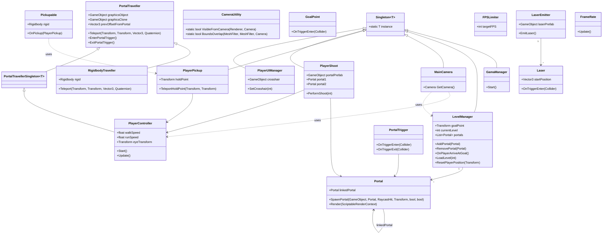

# Project Class Diagram

```mermaid
classDiagram
    class Singleton~T~ {
        +static T instance
    }

    class PortalTraveller {
        +GameObject graphicsObject
        +GameObject graphicsClone
        +Vector3 prevOffsetFromPortal
        +Teleport(Transform, Transform, Vector3, Quaternion)
        +EnterPortalTrigger()
        +ExitPortalTrigger()
    }

    class PortalTravellerSingleton~T~ {
    }

    class CameraUtility {
        +static bool VisibleFromCamera(Renderer, Camera)
        +static bool BoundsOverlap(MeshFilter, MeshFilter, Camera)
    }

    class GoalPoint {
        +OnTriggerEnter(Collider)
    }

    %% Interactables
    class Pickupable {
        +Rigidbody rigid
        +OnPickup(PlayerPickup)
    }

    class RigidbodyTraveller {
        +Rigidbody rigid
        +Teleport(Transform, Transform, Vector3, Quaternion)
    }

    %% Managers
    class FPSLimiter {
        +int targetFPS
    }

    class GamaManager {
        +Start()
    }

    class LevelManager {
        +Transform goalPoint
        +int currentLevel
        +List~Portal~ portals
        +AddPortal(Portal)
        +RemovePortal(Portal)
        +OnPlayerArriveAtGoal()
        +LoadLevel(int)
        +ResetPlayerPosition(Transform)
    }

    %% Player
    class MainCamera {
        +Camera GetCamera()
    }

    class PlayerController {
        +float walkSpeed
        +float runSpeed
        +Transform eyeTransform
        +Start()
        +Update()
    }

    class PlayerPickup {
        +Transform holdPoint
        +TeleportHoldPoint(Transform, Transform)
    }

    class PlayerShoot {
        +GameObject portalPrefab
        +Portal portal1
        +Portal portal2
        +PerformShoot(int)
    }

    %% Tools
    class Laser {
        +Vector3 startPosition
        +OnTriggerEnter(Collider)
    }

    class LaserEmitter {
        +GameObject laserPrefab
        +EmitLaser()
    }

    class Portal {
        +Portal linkedPortal
        +SpawnPortal(GameObject, Portal, RaycastHit, Transform, bool, bool)
        +Render(ScriptableRenderContext)
    }

    class PortalTrigger {
        +OnTriggerEnter(Collider)
        +OnTriggerExit(Collider)
    }

    %% UI
    class FrameRate {
        +Update()
    }

    class PlayerUIManager {
        +GameObject crosshair
        +SetCrosshair(int)
    }

    %% Inheritance Relationships
    Singleton <|-- GamaManager
    Singleton <|-- LevelManager
    Singleton <|-- MainCamera
    Singleton <|-- PlayerPickup
    Singleton <|-- PlayerShoot
    Singleton <|-- PlayerUIManager
    
    PortalTraveller <|-- RigidbodyTraveller
    PortalTraveller <|-- PortalTravellerSingleton
    PortalTravellerSingleton <|-- PlayerController

    %% Associations
    LevelManager "1" --> "*" Portal
    PlayerShoot --> Portal
    Portal --> Portal : linkedPortal
    PortalTrigger --> Portal
    LaserEmitter "1" --> "*" Laser
    Pickupable ..> PlayerPickup : uses
    PlayerPickup --> PlayerController
    PlayerShoot --> PlayerController
    MainCamera ..> PlayerController : uses
    MainCamera ..> LevelManager : uses
```
